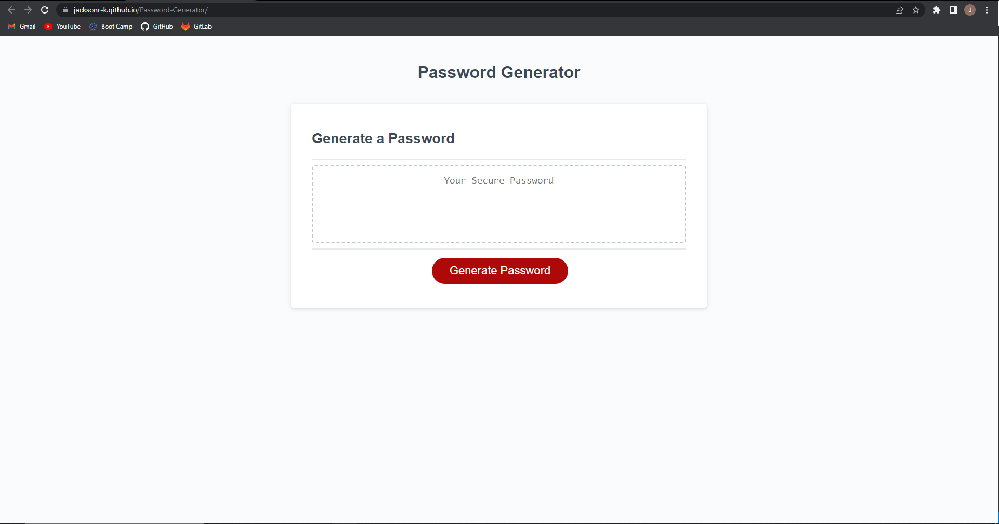
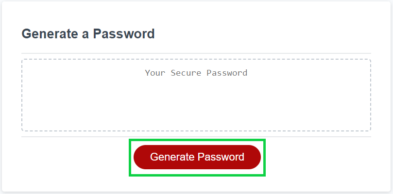
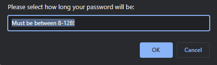
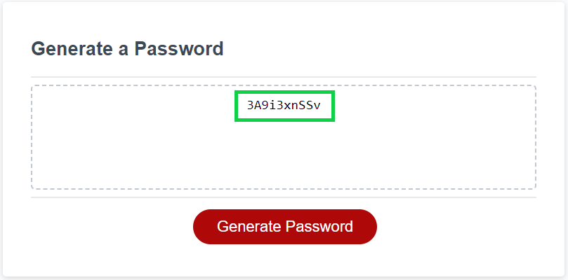

# Password-Generator

## Description
This program functions as a password generator that creates a personalized password based on a user's preferred characters.
The user is prompted with how long they would like their password and which character types are to be included in it.

## Usage
The user clicks the 'Generate Password' button.

The program then asks the user to select their preferred criteria based on the prompts.

Then the new password is displayed to the user.

## Links

Repository:
https://github.com/JacksonR-K/Password-Generator

Deployed Application:
https://jacksonr-k.github.io/Password-Generator/

## Credits

https://www.cs.cmu.edu/~pattis/15-1XX/common/handouts/ascii.html